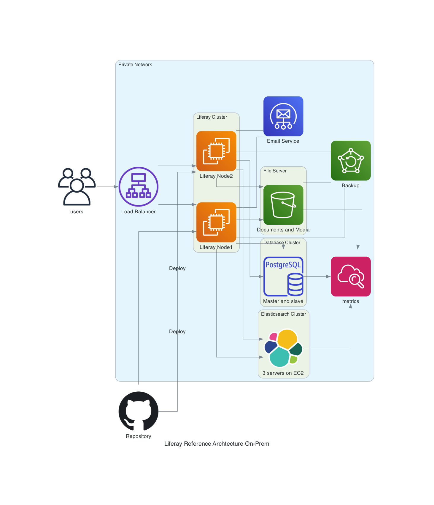

# Liferay Reference Archtecture Diagram
Liferay's reference architecture and pipeline

# Precondition
- Python 3.6 >=
- [Graphviz](https://graphviz.gitlab.io/download/)
- [Diagrams](https://diagrams.mingrammer.com/docs/getting-started/installation#quick-start)

# Generate the network diagram

## Install Diagram
1. Install [Graphviz](https://graphviz.gitlab.io/download/)
1. Install [Diagrams](https://diagrams.mingrammer.com/docs/getting-started/installation#quick-start)

## Generate Image
2. Run `python diagram.py`